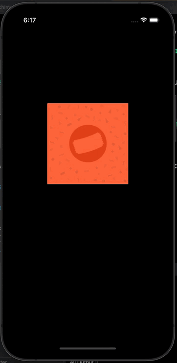

# ScratchCard

Implement a scratch card like Phonepe and GooglePay in native swift in a very simple way like below

Include this [ScratchImageView](ScratchCard/ScratchImageView.swift) in your project and you're good to go. The project is a demo for how this works using UIImageView.
